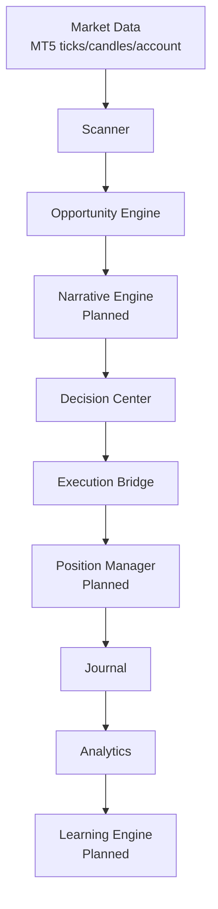
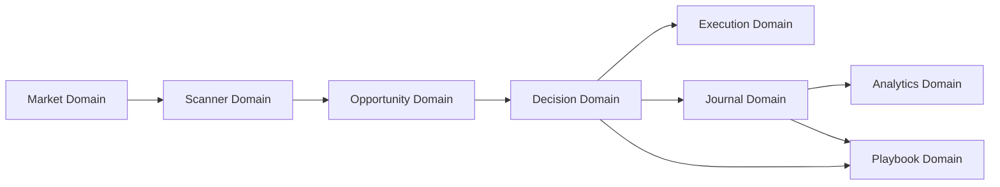
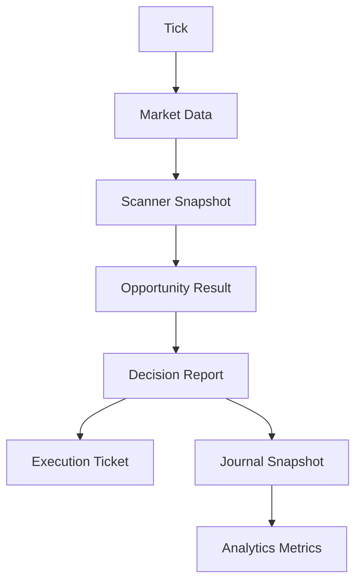

# OSCAR Architecture V2

Version: 1.0  
Status: Living Architecture Specification  
Audience: Software Architects, Backend/Frontend Engineers, QA Engineers

> [!NOTE]
> This document describes the implemented architecture as of HD-012.2 and marks future capabilities explicitly as Planned.

## Chapter 1. Product Vision

### 1.1 What OSCAR Is
OSCAR is an Institutional Trading Copilot that structures market context, evaluates opportunity quality, and prepares execution artifacts for human decision-making.

### 1.2 Problem It Solves
Retail and discretionary workflows often fail due to inconsistent context, non-repeatable decisions, and low traceability. OSCAR solves this by standardizing:

- Context generation
- Opportunity prioritization
- Execution preparation
- Decision traceability
- Performance analytics

### 1.3 What OSCAR Is Not

- Not an autonomous trading robot
- Not an auto-execution strategy engine
- Not a black-box signal provider

### 1.4 Why It Is Not a Trading Robot
The architecture separates analysis from action. Opportunity and execution modules compute readiness, but opening/modifying/closing trades still requires explicit user-triggered flows. No module in scanner/opportunity/execution bridge auto-submits trades.

### 1.5 Why Trader Control Is Permanent
OSCAR produces institutional context and quality signals; the trader owns timing and final authorization. This ensures accountability, adaptability, and compliance with Human In Command design.

### 1.6 Institutional Trading Copilot Definition
An Institutional Trading Copilot is a system that:

- Aggregates structured market context
- Scores setup quality across independent dimensions
- Explains internal rationale
- Prepares decisions and execution plans without autonomous commitment

### 1.7 Product Objectives

| Objective | Description | Current Status |
|---|---|---|
| Context Reliability | Deterministic context from market and structure services | Implemented |
| Opportunity Prioritization | Queue ranked by institutional relevance | Implemented |
| Execution Preparation | Trade ticket preparation with validations | Implemented |
| Human-Controlled Decisioning | Explicit human authorization before trade actions | Implemented |
| End-to-End Traceability | Decision snapshots persisted for later analytics | Implemented |
| Adaptive Learning Loop | Continuous learning feedback into scoring/automation | Planned |

### 1.8 Product KPIs

| KPI | Definition | Source |
|---|---|---|
| Context Freshness | Time since last valid tick/candle/decision context | Health Readiness |
| Opportunity Coverage | Assets with non-IGNORE action / total scanned assets | Opportunity Queue |
| Queue Precision Proxy | READY or ACTIVE outcomes later ending WIN/BREAK_EVEN | Journal + Analytics |
| Decision Latency | Time from snapshot generation to user decision capture | Opportunity + Journal |
| Execution Preparedness | % execution tickets with READY status | Execution Bridge |
| Explainability Completeness | % records with narrative + checklist + confluence details | Decision + Journal |

---

## Chapter 2. Product Philosophy

| Principle | Description | Motivation | Architectural Consequences |
|---|---|---|---|
| Context Before Execution | Market context must exist before any execution preparation | Prevent blind actions | Scanner/Decision precede Execution |
| Narrative Before Recommendation | Every recommendation must carry rationale | Improve trust and review quality | Decision report includes narrative/checklist/confluences |
| Human Always In Command | Final action belongs to trader | Risk governance and accountability | No autonomous execution path in scanner/opportunity/execution bridge |
| Automation Of Mechanics | Automate repetitive calculations and sorting | Reduce cognitive load | Scoring, ranking, validation, summarization services |
| Explainability | Outputs must be decomposable and inspectable | Auditable behavior | Structured schemas for scores, zones, checks |
| Modularity | Each domain has bounded responsibility | Safe evolution and parallel work | Domain folders and router/service isolation |
| Reusability | Shared contracts reused across modules | Avoid duplication | Decision snapshots reused by Journal/Playbook/Analytics |
| Observability | Runtime health and readiness must be visible | Operational reliability | Health engine + readiness endpoint |
| Testability | Domain logic should be unit-testable | Controlled regressions | Pure calculators/validators/engines + pytest coverage |
| Scalability | Design for future features without rewrites | Long-term maintainability | Separate scanner, opportunity, execution, journal, analytics |

---

## Chapter 3. OSCAR Constitution

1. OSCAR never opens a position without explicit trader authorization.
2. OSCAR never auto-submits orders from scanner or opportunity workflows.
3. Every recommendation must be explainable in structured fields.
4. Every score must be decomposable by factors and weights.
5. No black-box decisioning is accepted in production architecture.
6. Context generation must precede opportunity evaluation.
7. Opportunity evaluation must not re-query broker data directly.
8. Execution preparation must be independent from opportunity scoring.
9. Journal entries must preserve immutable decision snapshots.
10. Analytics must consume persisted artifacts, not recalculate market context.
11. Domain modules must remain loosely coupled and explicitly typed.
12. Backward compatibility of public API contracts is mandatory unless versioned.
13. Critical health degradation must be observable through readiness endpoints.
14. Planned features must be explicitly labeled as Planned in documentation.
15. Architecture decisions must precede implementation changes.
16. Pure computation should be isolated from side-effectful integration code.
17. Safety checks are mandatory before any execution-capable path.
18. System evolution must prioritize traceability and reproducibility over speed.

---

## Chapter 4. System Overview

### 4.1 End-to-End Flow

1. Market data is normalized by Market Service.
2. Scanner builds periodic multi-asset institutional snapshots.
3. Opportunity Engine converts snapshots into prioritized queue items.
4. Narrative Engine enriches opportunity stories (Planned).
5. Decision Center creates decision reports and recommendation narratives.
6. Execution Bridge prepares institutional trade tickets and validations.
7. Position Manager governs live lifecycle operations (Planned).
8. Journal stores decision snapshots and trader outcomes.
9. Analytics computes deterministic performance metrics.
10. Learning Engine closes feedback loop into model/scoring evolution (Planned).

> [!WARNING]
> Trade endpoints exist for manual execution compatibility, but autonomous execution remains disallowed by constitution.

---

## Chapter 5. Domain Architecture

### 5.1 Domain Matrix

| Domain | Responsibility | Inputs | Outputs | Dependencies | Current State | Future State |
|---|---|---|---|---|---|---|
| Scanner | Build periodic institutional snapshots per configured symbols | Settings symbols, Market tick/spread, SmartMoney structure | OpportunitySnapshot list | MarketService, SmartMoneyService, settings | Implemented (30s scheduler, stage model, health/summary fields) | Add richer liquidity/order-flow descriptors (Planned) |
| Opportunity | Evaluate snapshots into queue-ready opportunities | Scanner snapshots only | Opportunity queue + market summary | Scanner service | Implemented (scores, stage mapping, priority, ETA, action) | Adaptive weighting + alert hooks (Planned) |
| Decision | Build full decision report and narrative | DecisionContext + market/structure data | DecisionReport | MarketService, SmartMoneyService | Implemented | Narrative Engine integration and richer multi-timeframe rationale (Planned) |
| Execution | Prepare institutional trade ticket and validations | ExecutionRequest + optional account/market data | ExecutionResult | Calculator, Validator, MarketService | Implemented (prepare-only bridge) | Broker-facing command orchestration layer (Planned) |
| Journal | Persist decision snapshots and trader outcomes | JournalEntryCreate, decision report snapshot | Journal entries CRUD + filtering/search | In-memory repository | Implemented | Durable persistence and event streaming (Planned) |
| Analytics | Deterministic performance aggregation | Journal entries + Playbook stats | Summary/session/timeframe/symbol/risk/confluence reports | JournalService, PlaybookService | Implemented | Learning feedback connectors (Planned) |
| Frontend | Operator workspace and visualization | Public API contracts | Dashboard state and views | Axios API clients | Implemented | Dedicated scanner/opportunity dashboards (Planned) |
| Infrastructure | Runtime bootstrapping, health, configuration | Settings, process/runtime signals | Service lifecycle, readiness status | FastAPI, launcher scripts | Implemented | Container orchestration and environment promotion strategy (Planned) |

### 5.2 Domain Boundaries

> [!NOTE]
> Opportunity Domain consumes Scanner snapshots and does not directly call MT5.

---

## Chapter 6. Data Flow

### 6.1 Canonical Information Path

### 6.2 Data Contract Evolution

| Step | Artifact | Producer | Consumer |
|---|---|---|---|
| 1 | TickResponse/CandleResponse | Market Service | Scanner, Decision, Health |
| 2 | OpportunitySnapshotSchema | Scanner | Opportunity Engine |
| 3 | OpportunityResultSchema | Opportunity Service | Frontend, future alerting |
| 4 | DecisionReport | Decision Center / Operational Analysis | Journal, Playbook, UI |
| 5 | ExecutionResult | Execution Bridge | UI, future execution controls |
| 6 | JournalEntry | Journal Service | Analytics, Playbook |
| 7 | AnalyticsSummary + detail stats | Analytics Service | UI and reporting |

---

## Chapter 7. Project Structure

### 7.1 Repository Top-Level

| Path | Responsibility |
|---|---|
| backend | FastAPI APIs, domain services, schemas, engines, tests |
| frontend | React/Vite operator workspace and API clients |
| docs | Architecture and project governance documentation |
| launcher | One-click local orchestration scripts for backend/frontend |
| scripts | Validation and operational helper scripts |
| database | SQLite file artifacts |
| reports | Validation and execution reports |

### 7.2 Backend Structure

| Path | Responsibility |
|---|---|
| backend/app/api | API composition and HTTP contracts |
| backend/app/market | MT5 market connectivity and normalized data |
| backend/app/smart_money | Swing + market structure derivation |
| backend/app/scanner | Multi-asset snapshot generation + scheduler |
| backend/app/opportunity | Scoring, prioritization, queue generation |
| backend/app/services | Core cross-domain services (decision, execution legacy, health) |
| backend/app/execution | Execution bridge preparation domain |
| backend/app/journal | Decision snapshot persistence and trader outcomes |
| backend/app/playbook | Declarative setup matching and statistics |
| backend/app/analytics | Deterministic performance analytics |
| backend/tests | Unit/integration regression suite |

### 7.3 Frontend Structure

| Path | Responsibility |
|---|---|
| frontend/src/api | Typed API clients per backend domain |
| frontend/src/components | Reusable UI blocks |
| frontend/src/pages | Screen composition (Dashboard) |
| frontend/src/test | Frontend test bootstrap |

---

## Chapter 8. Roadmap

### 8.1 Implemented

- Market data access and terminal status
- Smart money swing/structure analysis
- Decision Center reports and narrative
- Journal snapshot persistence and filtering
- Playbook setup evaluation and statistics
- Performance analytics aggregates
- Execution Bridge Foundation (prepare-only ticket)
- Scanner Foundation (multi-asset snapshots + scheduler)
- Opportunity Engine (queue, scoring, priority, ETA)

### 8.2 In Progress

- Architecture consolidation for cross-domain specifications (HD-013 series)
- Contract alignment between backend analytics models and frontend typed clients
- Operational lifecycle migration from router on_event hooks to lifespan integration

### 8.3 Planned

- Narrative Engine (post-opportunity narrative enrichment)
- Position Manager (post-execution lifecycle control)
- Smart Alerts over opportunity queue
- Scanner Dashboard and dedicated opportunity workspace
- Learning Engine integrating analytics feedback into scoring

### 8.4 Long Term

- Event-driven domain integration
- Persistent storage strategy upgrade
- Strategy simulation and retrospective explainability tooling
- AI-assisted adaptive scoring under strict explainability constraints

---

## Chapter 9. Architectural Decisions

| Decision | Rationale | Trade-Off |
|---|---|---|
| Scanner is separate from Opportunity | Clear separation between context acquisition and opportunity valuation | Extra service boundary and object mapping |
| Opportunity Engine exists as dedicated domain | Independent scoring/ranking evolution without touching scanner internals | Additional contracts to maintain |
| Decision remains independent from Opportunity | Supports manual/operational report generation independently from queue | Potential overlap in scoring semantics |
| Execution Bridge is a dedicated preparation module | Isolates risk/math validation from execution actions | Requires integration planning for future command layer |
| Journal is independent | Preserves immutable snapshots and auditability | Requires mapping from decision contracts |
| Analytics is downstream-only | Deterministic, replayable metrics from persisted records | Metrics quality depends on journal completeness |
| Human In Command is constitutional | Safety, governance, and accountability | Lower automation throughput by design |
| Strong typed schemas across domains | Contract stability and testability | Higher upfront schema maintenance |
| In-memory repositories for journal/playbook/scanner | Fast iteration and deterministic tests | Non-durable state until persistence upgrade |

> [!IMPORTANT]
> Compatibility trade execution endpoints are maintained for existing workflows; they do not redefine OSCAR as an autonomous trading robot.

---

## Chapter 10. Design Principles

| Principle | Implementation Pattern in OSCAR |
|---|---|
| Low Coupling | Domain-specific services and routers with explicit boundaries |
| High Cohesion | Scanner/opportunity/execution each own a focused responsibility |
| Pure Functions | Execution calculator/validator and scoring factors are isolated and testable |
| Domain Driven Design | Bounded contexts with dedicated models/schemas/services |
| SOLID | Composition over inheritance in service assembly; single-purpose modules |
| Testability | Unit tests for engine/ranking/scheduler/service/API layers |
| Configuration Over Hardcoding | Symbol universe, defaults, and timeouts from settings |
| Dependency Inversion | Services accept repositories/engines via constructor injection where needed |
| Event Ready | Scheduler/health/event semantics structured for future event bus expansion |
| Future AI Ready | Score decomposition and narrative fields are explicit and machine-consumable |

### 10.1 Architecture Notes

- Current scanner scheduler uses router startup/shutdown hooks; migration to application lifespan is recommended.
- Analytics exposes both current and legacy aliases for backward compatibility.
- Decision reports currently include recommendation types BUY/SELL/WAIT/NO_TRADE for analysis context.

### 10.2 Decision Notes

- Keep opportunity actions non-directional (IGNORE, MONITOR, WATCH, PREPARE, READY, ACTIVE) to preserve copilot semantics.
- Keep trade execution actions human-triggered, never scanner/opportunity-triggered.
- Preserve schema stability and add new capabilities through additive evolution and clear Planned labeling.

---

## Specification Coverage Map

| Requested Area | Coverage |
|---|---|
| Product Vision | Chapter 1 |
| Product Philosophy | Chapter 2 |
| OSCAR Constitution | Chapter 3 |
| System Overview | Chapter 4 |
| Domain Architecture | Chapter 5 |
| Data Flow | Chapter 6 |
| Project Structure | Chapter 7 |
| Roadmap | Chapter 8 |
| Architectural Decisions | Chapter 9 |
| Design Principles | Chapter 10 |

## Pending Topics for HD-013.2

1. Define formal ADR template and create ADR index per major domain decision.
2. Introduce canonical glossary for terms (context, opportunity, readiness, confluence, quality).
3. Specify versioned API lifecycle policy including deprecation windows.
4. Define persistence strategy roadmap for scanner/opportunity/journal state durability.
5. Add non-functional architecture budgets (latency, throughput, availability, data retention).
6. Define event contracts for Planned Narrative Engine, Position Manager, and Learning Engine.
7. Align frontend analytics typings with backend analytics response contracts.
8. Add security architecture section (authn/authz, audit trails, secrets management) once scope is approved.
