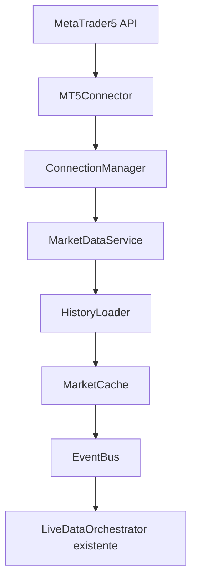
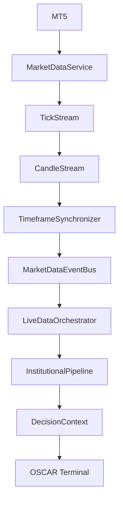

# OSCAR Trade IA

## Market Data Engine

El Market Data Engine encapsula la unica capa autorizada para comunicarse con MetaTrader 5. La implementacion vive en `src/core/marketData` y mantiene desacoplados el transporte, el ciclo de vida de conexion, la cache, la carga historica y la distribucion de eventos.

## Responsabilidades

- `MT5Connector`: inicializacion, autenticacion, apagado, reconexion, health check y mapeo de errores tipados sin logica de negocio.
- `ConnectionManager`: maquina de estados de conexion, deteccion de timeout, desconexion, terminal cerrada, login invalido y reconexion automatica con backoff exponencial.
- `MarketDataService`: fachada unica para `get_ticks`, `get_latest_tick`, `get_candles`, `get_last_closed_candle`, `get_symbol_info` y `get_market_status`.
- `HistoryLoader`: descarga historico para `M1`, `M5`, `M15`, `M30`, `H1`, `H4` y `D1` con volumen configurable.
- `MarketCache`: cache en memoria con TTL configurable para ticks, candles, symbol info y estado de mercado.
- `MarketDataEventBus`: eventos inmutables para `ConnectionEstablished`, `ConnectionLost`, `HistoryLoaded`, `MarketUpdated`, `TickReceived` y `CandleClosed`.
- `settings`: configuracion centralizada basada en `VITE_MT5_*` sin credenciales embebidas en codigo.

## Live Streaming Engine

El Live Streaming Engine conecta el Market Data Engine con `InstitutionalPipeline` de forma 100% orientada a eventos y desacoplada mediante `MarketDataEventBus`.

### Componentes

- `TickStream`: inicia/paraliza polling de ticks, reconecta automaticamente y publica `TickReceived` y `TickBatchReceived`.
- `CandleStream`: escucha ticks, detecta cierre de vela para `M1`, `M5`, `M15`, `M30`, `H1`, `H4`, `D1` y publica `CandleClosed`.
- `TimeframeSynchronizer`: mantiene estado sincronizado de cierres por timeframe y publica `TimeframeUpdated`.
- `LiveDataOrchestrator`: escucha `CandleClosed`, aplica debounce + rate limit, refresca snapshot desde `MarketDataService`, ejecuta `InstitutionalPipeline` y publica `PipelineExecuted` y `DecisionContextUpdated`.

### Ciclo De Vida

1. `LiveDataOrchestrator.attachLiveEngine(...)` inyecta dependencias de streaming.
2. `startLive(symbol)` activa sincronizador, detector de velas y stream de ticks.
3. Cada `TickReceived` puede derivar en `CandleClosed`.
4. `CandleClosed` dispara ejecucion controlada por backpressure.
5. Se actualiza cache/historico, se recalcula pipeline y se publica nuevo `DecisionContextUpdated`.
6. `stopLive()` apaga listeners, timers y streams de forma limpia.

### Eventos Tipados

- `TickReceived`
- `TickBatchReceived`
- `CandleClosed`
- `TimeframeUpdated`
- `PipelineExecuted`
- `DecisionContextUpdated`

Todos los eventos se publican como objetos inmutables.

## Settings

- `VITE_MT5_TERMINAL_PATH`
- `VITE_MT5_LOGIN`
- `VITE_MT5_PASSWORD`
- `VITE_MT5_SERVER`
- `VITE_MT5_RECONNECT_INTERVAL_MS`
- `VITE_MT5_RECONNECT_MAX_INTERVAL_MS`
- `VITE_MT5_RECONNECT_MAX_ATTEMPTS`
- `VITE_MT5_CACHE_TTL_MS`
- `VITE_MT5_HISTORY_SIZE`
- `VITE_MT5_HEALTH_CHECK_INTERVAL_MS`
- `VITE_MT5_TICK_POLL_INTERVAL_MS`
- `VITE_MT5_TICK_BATCH_MAX_SIZE`
- `VITE_MT5_TICK_BATCH_FLUSH_INTERVAL_MS`
- `VITE_MT5_TICK_RATE_LOG_INTERVAL_MS`
- `VITE_MT5_LIVE_DEBOUNCE_MS`
- `VITE_MT5_LIVE_RATE_LIMIT_MS`

## Logging

Se registran conexion, reconexion, errores, carga historica y latencia a traves de un `Logger` inyectable. El `ConsoleLogger` sirve como implementacion por defecto y puede sustituirse por cualquier adaptador estructurado.

Metricas principales del modo live:

- Tick rate por ventana configurable.
- Latencia de ejecucion del pipeline.
- Latencia de construccion de `DecisionContext`.
- Eventos descartados por rate limit.
- Reintentos/reconexiones.

## Tests

La suite de `src/core/marketData/__tests__` mockea completamente la API de MetaTrader 5 mediante `Mt5Bridge`, sin depender de una terminal real.

Cobertura funcional agregada:

- `TickStream.test.ts`
- `CandleStream.test.ts`
- `TimeframeSynchronizer.test.ts`
- `LiveDataOrchestrator.live.test.ts`
- `EventBus.test.ts` (eventos live inmutables)